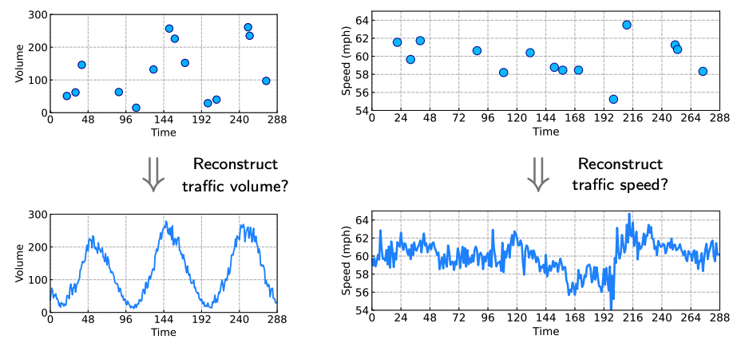
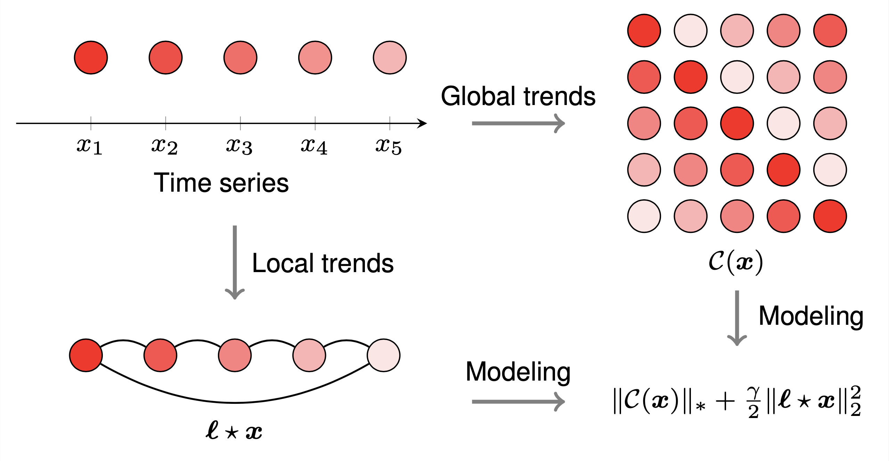
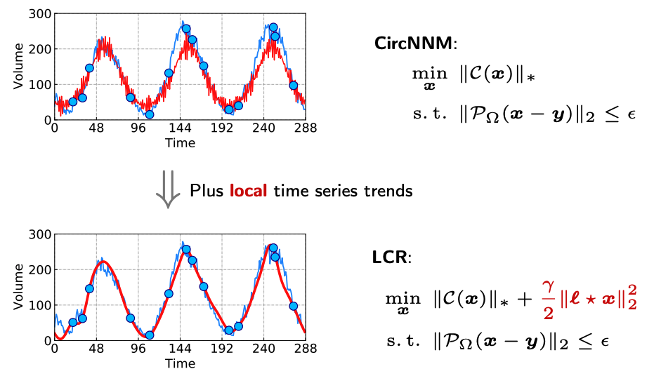

# LCR
[](https://opensource.org/licenses/MIT)

[](https://github.com/xinychen/LCR/archive/master.zip)
[](https://github.com/xinychen/LCR)

<h6 align="center">Made by Xinyu Chen • :globe_with_meridians: <a href="https://xinychen.github.io">https://xinychen.github.io</a></h6>

<br>

> Laplacian convolutional representation (**LCR**) for traffic time series imputation.

## Documentation

### Problem Definition

In this research, we aim at addressing traffic time series imputation problems by carefully utilizing global and local trends underlying the data, see Figure 1. While the global time series trend can be modeled by the circulant matrix nuclear norm optimization, we propose to characterize the local time series trend with Laplacian kernels and regularization. 

<p align="center">

</p>

<p align = "center">
<b>Figure 1.</b> Traffic time series imputation on a large portion of missing values.
</p>

### Framework

As shown in Figure 2, the objective function of the optimization problem in LCR has two components which come from two procedures. The first procedure is building [circulant matrix](https://en.wikipedia.org/wiki/Circulant_matrix) on the given time series. The second procedure is correlating the local time series trend with a [circulant graph](https://en.wikipedia.org/wiki/Circulant_graph) structure, referring to a circular Laplacian kernel.

<p align="center">

</p>

<p align = "center">
<b>Figure 2.</b> Illustration of the LCR model on univariate time series.
</p>

### Experiments

We evaluate the LCR model on several traffic flow datasets, including
- Portland traffic speed/volume data [[Open data system in Portland](https://portal.its.pdx.edu/)]
- HighD speed field data [[Original data source website](https://www.highd-dataset.com/)]
- CitySim speed field data [[Original data source website](https://github.com/ozheng1993/UCF-SST-CitySim-Dataset)]
- PeMS traffic speed data in California [[PeMS-4W in `.npz`](https://github.com/xinychen/transdim/tree/master/datasets/California-data-set)]

#### Quick Start

We implement LCR algorithm with `numpy`, being as easy as possible. It should be no barrier for running these codes on any Python environment with `numpy`. Our Python implementation with `numpy` can be adapted to a GPU implementation with `cupy`, please replace `import numpy as np` by `import cupy as np`. It would be not difficult to follow the experiment. Some key functions are summarized as follows,

- `laplacian`: Generating a Laplacian kernel with hyperparameter `tau`.
- `prox`: Performing L1-norm minimization with a thresholding method in the complex space.
- `update_z`: There is a closed-form solution to the variable z.
- `update_w`: This is a standard update of the variable w in ADMM.
- `LCR`: This is the main function for implementing LCR.

<br>

```python
import numpy as np

def compute_mape(var, var_hat):
    return np.sum(np.abs(var - var_hat) / var) / var.shape[0]

def compute_rmse(var, var_hat):
    return np.sqrt(np.sum((var - var_hat) ** 2) / var.shape[0])

def laplacian(n, tau):
    ell = np.zeros(n)
    ell[0] = 2 * tau
    for k in range(tau):
        ell[k + 1] = -1
        ell[-k - 1] = -1
    return ell

def prox(z, w, lmbda, denominator):
    T = z.shape[0]
    temp1 = np.fft.fft(lmbda * z - w) / denominator
    temp2 = 1 - T / (denominator * np.abs(temp1))
    temp2[temp2 <= 0] = 0
    return np.fft.ifft(temp1 * temp2).real

def update_z(y_train, pos_train, x, w, lmbda, eta):
    z = x + w / lmbda
    z[pos_train] = (lmbda / (lmbda + eta) * z[pos_train] 
                    + eta / (lmbda + eta) * y_train)
    return z

def update_w(x, z, w, lmbda):
    return w + lmbda * (x - z)

def LCR(y_true, y, lmbda, gamma, tau, maxiter = 50):
    eta = 100 * lmbda
    T = y.shape
    pos_train = np.where(y != 0)
    y_train = y[pos_train]
    pos_test = np.where((y_true != 0) & (y == 0))
    y_test = y_true[pos_test]
    z = y.copy()
    w = y.copy()
    ell = np.fft.fft(laplacian(T, tau))
    denominator = lmbda + gamma * np.abs(ell) ** 2
    del y_true, y
    show_iter = 100
    for it in range(maxiter):
        x = prox(z, w, lmbda, denominator)
        z = update_z(y_train, pos_train, x, w, lmbda, eta)
        w = update_w(x, z, w, lmbda)
        if (it + 1) % show_iter == 0:
            print(it + 1)
            print(compute_mape(y_test, x[pos_test]))
            print(compute_rmse(y_test, x[pos_test]))
            print()
    return x
```

One simple example is Portland traffic volume time series imputation, please following these codes:

```python
import numpy as np
np.random.seed(1)
import time

missing_rate = 0.95
print('Missing rate = {}'.format(missing_rate))

dense_mat = np.load('../datasets/Portland-data-set/volume.npy')
d = 3
dense_vec = dense_mat[0, : 96 * d]
T = dense_vec.shape[0]
sparse_vec = dense_vec * np.round(np.random.rand(T) + 0.5 - missing_rate)

lmbda = 1e-2 * T
gamma = 5 * lmbda
tau = 2
maxiter = 100
x = LCR(dense_vec, sparse_vec, lmbda, gamma, tau, maxiter)

import matplotlib.pyplot as plt
plt.rcParams.update({'font.size': 15})

fig = plt.figure(figsize = (5.5, 2.4))
ax = fig.add_subplot(111)
plt.plot(dense_vec[: 96 * d], 'dodgerblue', linewidth = 1.5)
plt.plot(x[: 96 * d], 'red', linewidth = 3)
pos = np.where(sparse_vec != 0)
plt.plot(pos[0], sparse_vec[pos], 'o', 
         markeredgecolor = 'darkblue', 
         markerfacecolor = 'deepskyblue', markersize = 10)
plt.xlabel('Time')
plt.ylabel('Volume')
plt.xticks(np.arange(0, 96 * d + 1, 48))
plt.xlim([0, 96 * d])
plt.yticks(np.arange(0, 301, 100))
plt.ylim([0, 300])
plt.grid(linestyle = '-.', linewidth = 0.5)
ax.tick_params(direction = 'in')

plt.savefig('volumes_95.pdf', bbox_inches = "tight")
plt.show()
```

As shown in Figure 3, it is quite intuitive to see the performance gains (more accurate estimates) of LCR over the baseline model with only global trend modeling.

<p align="center">

</p>

<p align = "center">
<b>Figure 3.</b> Performance gains of LCR over the global trend modeling with circulant matrix nuclear norm minimization.
</p>

<br>

## Features

LCR is an efficient algorithm for univariate and multivariate time series imputation. In this repository, we aim to support you to explore traffic time series imputation problems with global and local trend modeling, referring to circulant matrix nuclear norm and Laplacian regularization, respectively. We provide friendly implementation with a few lines relying on the `numpy` package in Python.

<br>

## Cite Us

- Xinyu Chen, Zhanhong Cheng, HanQin Cai, Nicolas Saunier, Lijun Sun (2024). [Laplacian convolutional representation for traffic time series imputation](https://doi.org/10.1109/TKDE.2024.3419698). IEEE Transactions on Knowledge and Data Engineering. Early Access. [[PDF](https://xinychen.github.io/papers/Laplacian_convolution.pdf)] [[Slides](https://xinychen.github.io/slides/LCR24.pdf)]

or 

```tex
@article{chen2024laplacian,
  title={Laplacian convolutional representation for traffic time series imputation},
  author={Chen, Xinyu and Cheng, Zhanhong and Cai, HanQin and Saunier, Nicolas and Sun, Lijun},
  journal={IEEE Transactions on Knowledge and Data Engineering},
  year={2024},
  publisher={IEEE}
}
```

<br>

## Supported by

<a href="https://ivado.ca/en">

</a>
<a href="https://www.cirrelt.ca/">

</a>
